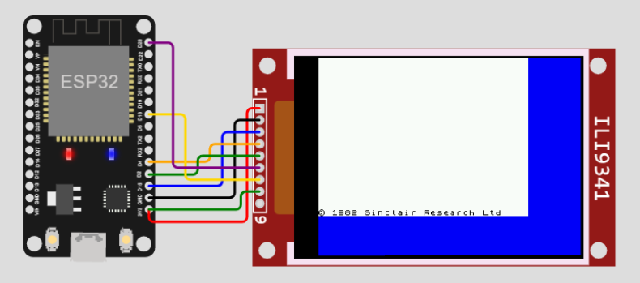

# RustZX for ESP32 - experimental version

Goal of the project: Run ZX Spectrum on ESP32

HW: ESP32 with ILI9341



## Build using GitPod

[](https://gitpod.io/github.com/georgik/rustzx-esp32/)

```
cargo build --release
```

### Other targets

- [](https://gitpod.io/github.com/georgik/rustzx-esp32/) - ESP32 (Xtensa) - branch: [main](https://github.com/georgik/rustzx-esp32/)
- [](https://gitpod.io/github.com/georgik/rustzx-esp32/tree/target/esp32s2) - ESP32-S2 (Xtensa) - branch: [target/esp32s2](https://github.com/georgik/rustzx-esp32/tree/target/esp32s2)
- [](https://gitpod.io/github.com/georgik/rustzx-esp32/tree/target/esp32s3) - ESP32-S3 (Xtensa) - branch: [target/esp32s3](https://github.com/georgik/rustzx-esp32/tree/target/esp32s3)
- [](https://gitpod.io/github.com/georgik/rustzx-esp32/tree/target/esp32c3) - ESP32-C3 (RISC-V) - branch: [target/esp32c3](https://github.com/georgik/rustzx-esp32/tree/target/esp32c3)


## Build

Open in VS Code with Dev Container support.

Run:

```
./build-rustzx.sh
```

## Build and flash

Build for ESP32 Using cargo-espflash for ESP32-S3 USB OTG:

```
cargo +esp-1.60.0.1 espflash --target xtensa-esp32-espidf --release --features "esp32c3_ili9341"
```


Build for ESP32-S3 USB OTG sing cargo-espflash:

```
cargo +esp-1.60.0.1 espflash --target xtensa-esp32-espidf --release --features "esp32s3_usb_otg"
```

With PowerShell:

```
.\Build-RustZX.ps1 -Target xtensa-esp32s2-espidf -Board kaluga_ili9341 -Port COM23
```

## Build and run Wokwi simulation

Run in with Wokwi simulator:

```
./run-wokwi.sh
```
### Debuging with Wokwi
```
$HOME/.espressif/tools/xtensa-esp32-elf/esp-2021r2-patch3-8.4.0/xtensa-esp32-elf/bin/xtensa-esp32-elf-gdb target/xtensa-esp32-espidf/debug/rustzx-esp32 -ex "target remote localhost:9333"
```

## HW Setup

### Display connection

| ILI9341 |  ESP32-DevKitS-V1.1 | Cable color |
----------|---------------------|-------------|
| GND     | GND                 | black       |
| 3.3V    | 3.3V                | red         |
| RST     | GPIO4               | orange      |
| CLK     | GPIO18              | yellow      |
| D_C     | GPIO2               | green       |
| CS      | GPIO15              | blue        |
| MOSI    | GPIO23              | purple      |
| MISO    | not connected       | -           |


Wokwi related project: https://wokwi.com/projects/331440829570744915 - [diagram.json](docs/diagram.json)

## References

- Rust code for ESP32 based on https://github.com/ivmarkov/rust-esp32-std-demo
- RustZX wrapper code reused from https://github.com/pacmancoder/rustzx
